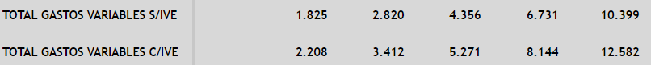
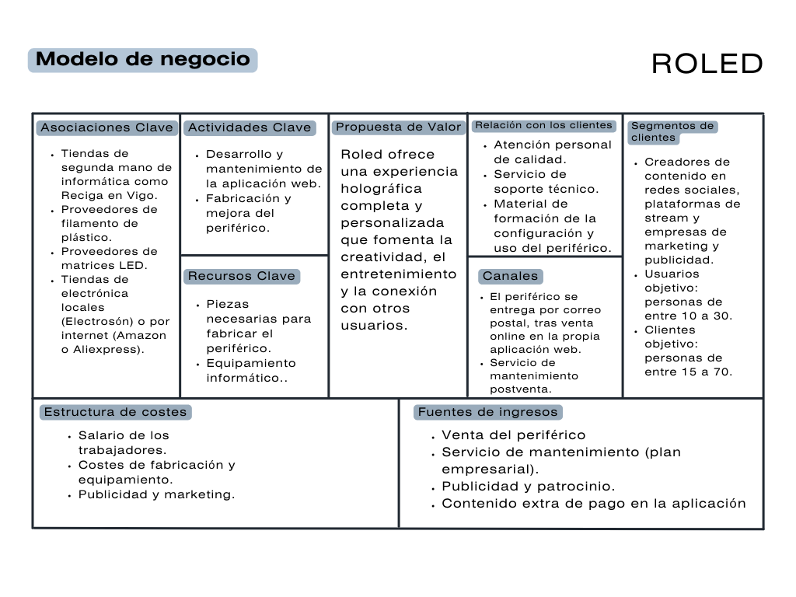
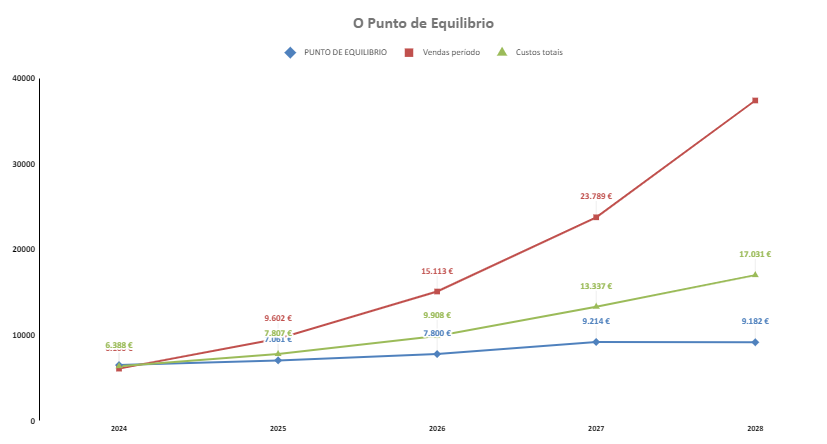
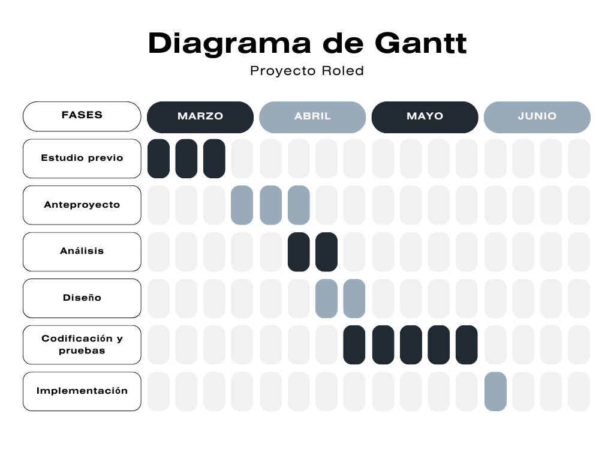

# Anteproxecto fin de ciclo

- [Anteproyecto fin de ciclo](#anteproyecto-fin-de-ciclo)
  - [1- Descripción del proyecto](#1--descripción-del-proyecto)
  - [2- Justificación del proyecto](#2--justificación-del-proyecto)
  - [3- Ayudas y financiación](#3--ayudas-y-financiación)
  - [4- Prevención de riesgos laborales](#4--prevención-de-riesgos-laborales)
  - [5- Modelo de negocio](#5--modelo-de-negocio)
    - [5.1- Viabilidad](#51--viabilidad)
      - [5.1.1- Viabilidad técnica](#511--viabilidad-técnica)
      - [5.1.2- Viabilidad económica](#512--viabilidad-económica)
    - [5.2- Competencia](#52--competencia)
    - [5.3- Promoción](#53--promoción)
  - [6- Requerimentos](#6--requerimientos)
  - [7- Planificación](#7--planificación)

## 1- Descripción del proyecto

No hace mucho tiempo las imágenes holográficas parecían una azaña del futuro, propias de las novelas de Clarke y Asimov. La aparición de la tecnología Led junto con el fenómeno de persistencia de la visión, permite que de forma relativamente sencilla se puedan generar imágenes holográficas. Es en este principio en el que se sustenta el proyecto Roled. Consiste en una aplicación web que permite la subida y la creación de imágenes que, tras ser tratadas y convertidas a un formato correcto, son enviadas a un periférico que proyecta esas imágenes de forma holográfica. Este periférico consiste en una pantalla POV ("Persistence of vision") formado por una matriz de Leds que al girar a una velocidad determinada permiten que el ojo humano no sea capaz de distinguir cada uno de los leds por separado y los perciba como una imagen unificada que puede ser estática o una imagen en movimiento.
Esta aplicación web también funciona como un software de diseño con herramientas básicas de dibujo que permite al usuario crear sus propios diseños para ser posteriormente proyectados. También permite la creación de animaciones sencillas basadas en fotogramas. 

Este tipo de productos son bastante populares en algunos países asiáticos como China, Japón o Corea, pero sus prototipos son de grandes dimensiones, convirtiéndolos en un producto muy costoso y poco práctico. Desde Roled, se pretende marcar la diferencia mediante un prototipo de "bolsillo", de pequeñas dimensiones y de un precio asequible que cualquiera pueda tener en su mesita de noche. Además, este va asociado a una aplicación web donde todos los usuarios pueden subir, crear y compartir sus diseños, pudiendo servir de plataforma para muchos artistas digitales que quieran dar a conocer su trabajo, a la vez que consigue que la experiencia del usuario sea más completa y creativa. 

Aunque en un inicio puede parecer que las aplicaciones de este producto son triviales y sirve como una mera decoración, puede tener cabida y una gran aceptación en el mundo de los videojuegos y los creadores de contenido, altamente rentable y extendido en la actualidad. También puede ser aplicado en el ámbito de la publicidad y el marketing, ya que es una forma sencilla y económica de mostrar marcas, productos e incluso spots publicitarios. 

El target de usuarios a los que va destinado Roled es aquel público relacionado con las redes sociales y las plataformas de stream, tanto del ámbito de los videojuegos como de contenido más artístico, por lo que se espera que sean principalmente el público más joven el que se vea atraído por este producto. Además, se espera explotar la facilidad con la que se crean tendencias y modas en redes sociales como TikTok para extender el producto entre el público, mediante campañas de marketing. 

Todo lo mencionado anteriormente, hace que sea posible la comercialización del proyecto, mediante la venta de la pantalla POV que tendrá como producto aumentado la aplicación web de dibujo. 

A continuación se muestra un pequeño esquema de las tecnologías necesarias para llevar a cabo el proyecto, las cuales se detallan con más profundidad en el punto 5.1.1 de Viabilidad técnica y en el punto 6 de Requerimientos.
- Para la pantalla POV se usará un motor, un controlador para ese motor, un microcontrolador, una tira de LEDs así como otros componentes electrónicos que son necesarios para su funcionamiento. El microcontrolador tendrá un sencillo programa en C++. 
- Para el frontend se usará CSS3, HTML5 y JavaScript.
- Para las operaciones CRUD se usará JavaScript o el framework JQuery.
- Para el backend se usará php o java. 
- Como base de datos se usará una base de datos relacional con el SGBD MySQL.
- Para la API se usará JSON.
- En caso de tener tiempo, se pretende añadir una IA a la aplicación de dibujo que permita la generación de imágenes para cargar al periférico. Este es el motivo por el que todavía no se ha decidido el lenguaje que se utilizará en el backend ya que depende de una librería específica. 

## 2- Justificación dej proyecto

La idea se originó viendo a un creador de contenido de la plataforma Twitch relacionado con el mundo de los videojuegos. Este creador, cada vez que un usuario realizaba una donación o una membresía, tenía que cortar lo que estuviese haciendo para agradecer su aportación o bien, si esta era de menor cantidad, aparecía en la pantalla del stream. Fue en este momento cuando surgió la idea de tener un dispositivo que mostrase los nombres de cada uno de estos usuarios mediante una imagen holográfica, pudiendo incluso mostrar su avatar en la plataforma de stream. Esta idea original fue derivando hasta llegar al proyecto Roled actual, pudiendo ser la idea inicial una aplicación muy rentable. 

El objetivo que se espera conseguir con el desarrollo de Roled es aumentar la oferta de aplicaciones que fomentan la creatividad, creando una aplicación que no solo aporte al usuario entretenimiento saludable y estimulante, sino que le permita formar parte de una comunidad de usuarios amigable y tolerante, aspectos muy difíciles de encontrar en Internet en la actualidad. Además, como se mencionó anteriormente, servirá de plataforma para que muchos artistas tengan visibilidad, pudiendo compartir sus proyectos de una forma muy atractiva y visual. También se estudiará si el proyecto puede llegar a comercializarse y ser rentable consiguiendo beneficios económicos.

## 3- Ayudas y financiación

Este apartado muestra el presupuesto necesario para poner en marcha el proyecto Roled, teniendo en cuenta la inversión necesaria, la amortización y los gastos fijos y variable, desde antes del inicio del proyecto, hasta el año 2028. 

**Inversiones**

Hace referencia a las inversiones de activo necesarios (intnagible, material y circulante).
- Intangible: se produce un gasto de 875€/año por el pago de la patente con una vida útil de 10 años. 
- Material: 
  - Maquinaria: hace referencia a las impresoras 3D necesarias para la realización del periférico, así como otras herramientas necesarias para su elaboración. Se estima un gasto inicial de 400€ ya que no es necesario un impresora de alta gama ni de grandes proporciones. Se necesita también un soldador (20€) y un polímetro (25€). Para el año 2024 y 2025 se estima una inversión de 60€ para el mantenimiento de estas herramientas y de las impresoras. Para el año 2026 se vuelve a invertir una suma de 600€ con el fin de mejorar las herramientas ya existentes, así como adquirir una nueva impresora 3D. La vida útil está establecida en 10 años.
  - Mobiliario de oficina: no se alquilará una oficina como tal con el fin de reducir gastos, pero será necesario adquirir mobiliario de almacenaje, estanterías, una silla de oficina, escritorio, una mesa de trabajo, etc, por una suma de 1000€. Este tiene una vida útil de 10 años. Para los cuatro años posteriores se invertirán pequeñas cantidades para el mantenimiento de ese mobiliario, desde los 100€ hasta los 350€ en 2028.
  - Equipamientos informáticos: este es uno de los gastos materiales más altos ya que es necesario tener un equipo con a suficiente potencia para poder desarrollar y probar el software adecuadamente. Se estima que el gasto inicial para el ordenador de sobremesa es de 2000€, incluyendo la pantalla y otros periféricos. Este tendrá una vida útil de 4 años, teniendo que aportar pequeñas cantidades para su mantenimiento. En el año 2028, se renovará este equipo por otro de características semejantes con un gasto de 2500€ teniendo en cuenta la subida de los precios que sufre la tecnología.
  - Se destinarán 120€ en material de oficina. 
- Financiero: no se considera necesario pedir financiación externa como préstamos a corto o largo plazo. 
- Corriente: hace referencia a las mercancías necesarias para realizar el periférico, las cuales se calcula que suponen un gasto inicial de 600€ incluyendo los motores (0€ ya que se cogerán en el punto limpio para reciclarlos), los controladores de los motores (5€), los microcontroladores(6€), el fin de carrera (0.5€) y la alimentación (10€). También hace referencia a las materias primas necesarias como el filamento de plástico (15€) o el estaño (10€), suponiento un gasto inicial de 200€. 

La siguiente imagen muestra el resultado del total de inversiones necesarias para antes de iniciar el proyecto, asi como cada años hasta el año 2028.

**Financiación a largo plazo**

No se considera necesario pedir ningún tipo de financiación a largo plazo, pero dado que la forma jurídica del proyecto es una cooperativa, se debe destinar un capital social antes del inicio del proyecto. En este caso, se establece en los estatutos una aportación de 1500€ para poder realizar la membresía al proyecto Roled. Como en un inicio consta de un socio, se tendrá un capital social inicial de 1500€ que se irá incrementando cada año hasta llegar a 5000€ en 2028.
Se pedirá una subvención que ofrece el IGAPE con un importe de 7500€, el primer año. 

**Gastos variables**

Se tiene el cuenta el coste unitario por cada uno de los productos que ofrece Roled:
- Periférico POV: coste unitario inicial de 40€ con una variación del 3%.
- Publicidad y marketing: coste unitario inicial de 40€ con una variación del 3%.
- Contenido de pago del software: coste unitario de 20€ con una variación del 3%.
- Mantenimiento de empresas: coste unitario de 45€ con una variación del 3%.

**Gastos de personal**

Se contará con un solo socio con un salario bruto de 1134€, que sumando los gastos de seguridad social, suma un total de 1474€/mes en 2024 con un aumento del 3% anual. 

**Gastos fijos**

En este apartado se tiene en cuenta los gastos fijos del proyecto Roled:
- Conservación y mantenimiento: 600€ el primer año con una variación del 3%.
- Seguros de resposabilidad civil: 120€/año.
- Publicidad y promoción: 600€/año durante el primer año, aunque se preveé que este gasto aumente significativamente.
- Dietas y gastos de viaje: 200€/año.
- Teléfono e internet: 360€/año.

En la siguiente imagen se muestra el resultado total de gastos variables, de salario y gastos fijos del proyecto, desglosándolo por producto o servicio que ofrece Roled:

## 4- Prevención de riesgos laborales

Para la elaboración del proyecto, no es necesario pedir ningún permiso, ya que no se va a llevar a cabo el alquiler de ningún local. A medio plazo, en caso de querer trasladarse a una oficina, se deberá pedir un permiso de uso comercial que dependerá de la legislación de la localidad en materia de vivienda. 
Es necesario, para poder vender el periférico POV, realizar todos los trámites para su homologación, cumpliendo una serie de requisitos:
- Certificación CE de la Unión Europea de calidad.
- Cumplimiento de las directivas europeas LVD (Directiva de Baja Tensión) y EMC (Directiva de Compatibilidad Electromagnética).
- Realizar pruebas para testear la calidad y la seguridad del dispositivo. 
- Otros requisitos: se contará con el asesoramiento de un experto para poder determinar los requisitos necesarios para poder vender el producto en España.

Para poder determinar los riesgos que acarrea la elaboración del proyecto, su impacto y las medidas necesarias para su prevención, se lleva a cabo la elaboración del Plan de prevención de riesgos, asociados a desarrolladores de software y electóniica. 
Los riesgos asociados a la elaboración del proyecto, son aquellos relacionados con todas las actividades de desarrollo de software y de personal de oficina que trabajan con equipos informáticos, así como aquellos relacionados con la fabricación del periférico en el taller:

**Trastornos músculoesqueléticos (TME)**

 Asociados al hecho de estar muchas horas sentados en una silla en una posición relativamente estática y poco natural, así como realizar movimientos repetitivos como teclear, mover el ratón, etc. Un equipamiento de oficina (escrittorio o las sillas) que no sea adecuado puede acarrear riesgos para el trabajador.

**Daño visual**

El uso prolongado de PVDs provoca un incremento de la fatiga visual, causando picor en los ojos, cefalea, sequedad, etc. 

**Riesgo de contacto eléctrico**

La elaboración del periférico POV acarrea un riesgo de contacto eléctrico por el uso de herramientas o equipos defectuosos, así como cables en mal estado. 

**Riesgo de incendio**

La posible aparición de cortocircuitos pueden provocar la generación de incendios. 

**Riesgo de cortes**

La tira Led del periférico gira a gran velocidad pudiendo producir cortes o heridas leves cuando entra en contacto con la piel al estar en funcionamiento, así como la manupulación de herramientas como tijeras para cortar cable y otras herramientas. 

**Riesgos psicosociales: tecnoestrés**

Asociado a los tiempos de entrega cortos que se producen en el desarrollo de software, a la dificultad de conseguir la desconexión digital, a una mala implementación del teletrabajo. Provoca un aumento del estrés y la ansiedad provocando un deterioramiento en la salud física  y mental del trabajador. 

**Riesgo de caídas al mismo y a distinto nivel**

Las caídas al mismo nivel o auqellas a distinto nivel cuando se sube a una escalera para poder alcanzar el stock almacenado, puede provocar graves lesiones en el trabajador.

El siguiente paso del plan de prevención de riesgos es analizar la probabilidad y el impacto que producen esos riegos, clasificándolos adecuadamente, como muestra la siguiene imagen.

Por último, tras identificar los riesgos y determinar su impacto, se diseñan medidas que traten de eliminar o minimizar esos riesgos. 

**Ergonomía**

Para reducir los TME se aplicarán los principios de la ergonomía, con sillas reajustables que permitan que el trabajador tenga una postura correcta que produzca el mínimo daño. Además, se realizarán descansos de 5 minutos cada hora de forma que el trabajador pueda levantarse o cambiar de postura evitando estar durante periodos prolongados con posturas poco naturales y estáticas. 
También se recomienta la realización de estiramientos de cuello y columna, antes de la jornada y durante ella, para evitar problemas en los músculos que más se ven afectados por el uso de ordenadores.

**Daño visual**

Para reducir el daño visual se aplicará mínimo 5 minutos de descanso cada hora, aplicando también la "regla del 20", es decir, cada 20 minutos mirar a una distancia de 20m durante 20segundos. 
También se cuidará la iluminación del lugar de trabajo para evitar reflejos sobre la pantalla, manteniendo esta a un mínimo de 500Lux.
Otra medida importante, es adquirir equipos adecuados, con pantallas que permitan ajustar parámetros como el brillo y que tengan una buena calidad para que su uso produzca menos fatiga visual. 
En caso de que estas medidas no sean suficientes, se adquirirá como EPI, unas lentes de filtro azul que protegen los ojos antes las PVDs.

**Riesgo de contacto eléctrico**

En primer lugar, es imporntante llevar a cabo un correcto mantenimiento de la instalación eléctrica para minimizar el riesgo de cortocircuitos. 
Se manipularán los equipos eléctricos con calzado adecuado y con las manos siempre secas. Se realizará una formación adecuada a los trabajadores para que conozcan detenidamente las medidas de prevención en esta materia. 

**Riesgo de incendio**

Se tendrá a disposición material de extinción de incendios. En caso de incendio, se apagarán los equipos informáticos para evitar el empeoramiento y se realizarán las medidas oportunas para tratar de mitigar, si es posible, el incendio, o bien realizar un plan de evacuación. En esta materia es muy importante también la correcta formación de los trabajadores.

**Riesgo de cortes**

Se usarán guantes protectores como EPI cuando se manipulen utensilios que puedan provocar cortes. 

**Riesgo de caídas al mismo nivel**

Se mantendrá el lugar de trabajo ordenado y sin obstáculos que puedan provocar caídas. Se prestará atención a líquidos u otras sustancias que puedan provocar resbalones.

**Riesgo de caída a distinto nivel**

Se utiliará correctamente y solamente las escaleras para acceder a material a distinto nivel. Será necesaria formación específica para los trabajadores en esta materia. 

**Tenoestrés**

Lo más importante es establecer límites al tiempo de trabajo, incentivando la desconexión digital durante los descansos. También se aplicará un horario flexible para una mejor conciliación de la vida personal y familiar, ofreciendo la modalidad de teletrabajo. 
Se garantizará que las condiciones de trabajo de temperatura, iluminación, ruidos, ergonomía son las adecuadas para que el trabajador pueda realizar su trabajo en un entorno confortable. 

Como suma a todo lo anterior, se realizarán cursos de formación en materia de prevención de riesgos a todos los trabajadores.

## 5- Modelo de negocio

En este apartado se analiza cuál es el mejor modelo de negocio para el proyecto Roled teniendo en cuenta diferentes aspectos como la compentecia, los proveedores, la viabilidad, los canales de distribución, las debilidades, las oportunidades, etc.
Para determinar las estrategias futuras del proyecto se realiza un análisis DAFO que permite detectar los factores internos y externos que pueden afectar al proyecto, como muestra la siguiente imagen.  

También se realizó el análisis CANVAS para determinar la propuesta de valor, los clientes, las fuentes de gastos y de ingresos, los proveedores, etc; es decir, todos aquellos factores que permitirán determinar si el proyecto se puede comercializar y de qué forma.

Teniendo en cuenta estos factores anteriormente citados, además, de los que se exponen en los siguientes puntos del apartado 5, explicados detalladamente, se opta por un modelo de negocio mixto, ya que las fuentes de ingreso son mixtas:
- Es un modelo de pago ya que el perifético POV es de pago y una de las principales fuentes de ingreso. 
- Aunque la aplicación web es gratuita, existe contenido exclusivo en la aplicación que es de pago, que aiunque no es una fuente de ingresos significativamente alta, ayuda durante las primeras fases a rentabilizar el proyecto. 
- Una de las fuentes de ingresos, con un peso importante, es la publicidad de terceros en la aplicación, por lo que también presenta elementos de un modelo de negocio por publicidad. 

El hecho de que el modelo de negocio sea mixto y no esté tan enfocado a una fuente de ingresos concreta, reduce el riesgo al no ser tan dependiende de esa fuente de ingresos. Además, la adaptabilidad a los cambios del proyecto es mayor, siendo este un beneficio muy importante en un ámbito tan cambiante e imprevisible como lo es el mundo tecnológico. 

En los siguientes puntos de este apartado, se explicará detalladamente el análisis de la viabilidad, la competencia y las vías de promoción escogidas que sustentan, además de los factores indicados anteriormente, la elección de un modelo de negocio mixto. 

### 5.1- Viabilidad

En este punto del documento se analizará la viabilidad del proyecto Roled, desde un punto de vista técnico y económico, con el fin de determinar los riesgos existentes y buscar una posible solución a los problemas que puedan surgir. 

#### 5.1.1- Viabilidad técnica

Desde un punto de vista técnico, el proyecto Roled es altamente viable, ya que los requerimientos materiales para su puesta en marcha son muy sencillos. La parte del proyecto que puede suponer un mayor problema es la realización del periférico, ya que se trata de un dispositivo físico. No obstante, su elaboración en cuanto a materias primas es asequible:
- El material básico con el que está fabricado es el plástico, por lo que todas las piezas de soporte y su estructura se realizan mediante una impresora 3D. Se usará filamento de plástico reciclado.
- Las tiras Led son muy económicas y fáciles de conseguir tanto en el mercado local como por Internet. 
- Los motores, como medida de resposabilidad civil corporativa, reciclarán de los discos HDD que van quedando obsoletos, disminuyendo los desechos informáticos y reduciendo el coste de elaboración del dispositivo.
- El microcontrolador que gestiona los Leds tampoco es difícil de conseguir y tiene un precio bastante económico ya que no se requiere de un dispositivo con alta potencia.
- Al ser un motor reciclado de otro dispositivo, no se puede reutilizar su controlador, por lo que es necesario comprar un controlador ESC económico.
- Para poder alimentar el microcontrolador, debido a las dificultades que ocasiona la conexión mediante cables al ser un dispositivo giratorio, se usan dos bobinas de transferencia de energía por inducción. 

En cuanto a los recursos humanos, se necesitará poco personal para el mantenimiento del software, aunque también se espera que este vaya aumentando a medida que vaya adquiriendo una comunidad mayor de usuarios y, por lo tanto, mayores necesidades de soporte.  Durante las primeras fases, no se espera que sea necesario aumentar los trabajadores de la empresa, quedando todo el trabajo relegado a una sola persona, reduciendo de esta forma los gastos de salarios.

En cuanto a las instalaciones, no se necesita un taller excesivamente grande, aunque sí es necesario disponer de espacio suficiente y adecuado para alojar la impresora (o impresoras) 3D. También se debe disponer de espacio de almacenaje suficiente para poder tener stock de las piezas necesarias para crear el periférico, así como de una mesa de trabajo para poder realizar su montaje. Para la elaboración del software se necesita un ordenador sobremesa, por lo menos de gama media, que permita el desarrollo y el mantenimiendo del software de Roled. Para minimizar gastos, durante el primer año se usará el domicilio como taller y almacén y se solicitará el uso del "Viveiro de empresas" del centro educativo IES Armando Cotarelo Valledo para reuniones con clientes, con proveedores, etc. 

El despliegue de la aplicación web se hará usando servicios de hosting. Las características de este despliegue todavía están en estudio y no se ha decidido qué tecnologías se usarán para realizarlo, quedando esa parte pendiente de determinar para fases posteriores del proyecto. 

El mayor impedimento técnico que existe en el proyecto puede surgir cuando el volumen de ventas crezca, ya que al elaborar la estructura del periférico mediante impresoras 3D, este puede tardar demasiado tiempo. No obstante esto se puede solucionar, con la compra de más impresoras de baja gama. Además, como el proyecto está diseñado para que vaya escalando poco a poco, esta mayor demanda podrá ser controlada con facilidad. 

#### 5.1.2- Viabilidad económica

En este apartado se analiza si el proyecto Roled es viablle en términos económicos. Para ello, se toma mano de los datos recogidos anteriormente en el apartado 3 de ayudas y financiación, apoyados en las estimaciones de venta hasta el año 2028. De todo esto, se extraen los beneficios obtenidos en cada ejercicio así como otra información de interés que indican si la salud económica del proyecto es buena y qué puntos pueden suponer un peligro para el desarrollo del proyecto a medio plazo. 
La siguiente imagen muestra las estimaciones de venta de cada uno de los productos y servicios que tiene Roled. La cantidad de cada producto establecida es la mínima cantidad que se estima, para evitar obtener datos poco realistas.

Suponiendo una variación de precios de entre el 3% y el 5%, así como un aumento de aproximadamente el 50% en número de ventas anual, para el año 2028 se estima que el total de ventas asciende a 37.445€ sin IVA, lo cual es un incremento significativo con respecto al año 2024 reflejado en la imagen anterior. 
Una vez calculadas las ventas, teniendo en cuenta los gastos variables y fijos explicados anteriormente, así como las inversiones necesarias, se obtienen los siguientes resultados:

**Beneficios**

El beneficio neto en el año 2024 es negativo de (288)€, lo cual es esperable ya que la inversión inicial es importante y el proyecto todavía no es conodido y no se ha afianzado en el mercado. No obstante, esa situación se recupera en el año 2025 y continúa en aumento, llegando a una cifra de 15.311€ de beneficio en el año 2028. Además, el flujo de efectivo presenta un valor de 821€ en 2024, llegando a 17.954€ en 2028, reflejando unos datos positivos que permiten la continuidad del proyecto. 

**Punto de equilibrio**

El punto de equilibrio es el umbral en el que los ingresos totales iguala a los gastos totales, de forma que a partir de este, el proyecto obtendrá beneficios. En el año 2024, el punto de equilibrio se estima en 6.511€ quedando a una distancia negativa de este de (411)€. No obstante, esta situación se corrige en los años posteriores llegando a un valor de punto de equilibrio de 9.182€ y una distancia de este de 28.263€.

**Balance**

Teniendo en cuenta el total de activo, pasivo, se calcula el fondo de Maniobra obteniendo los siguientes resultados:

- 2024: 4.550€
- 2025: 6.026€
- 2026: 10.725€
- 2027: 18.176€
- 2028: 29.361€

Estos datos indican que la situación financiera del proyecto Roled es estable, ya que esta tiene suficiente activo líquido para hacer frente a las deudas y gasto del pasivo a corto plazo. 

**Ratios**

- Volumen de negocio: experimenta un crecimiento del 57,41%.
- Productividad: en el año 2024 la productividad es de 3,60, llegando a 22,57 en el año 2028.
- Rentabilidad económica: en el año 2024 la rentabilidad es negativa, llegando a un valor positivo del 24.46% en el año 2028.
- Rentabilidad financiera: se inicia en 2024 con un valor negativo llegando al 27.29% en 2028.
- Ratio de tesoreria: Los valores de este ratio para el año 2024 son muy elevados, demostrando una mala utilización de los recursos del proyecto. Para el año 2028 el ratio de tesoreria mejora notablemente a una valor de 9,48 siendo todavía un valor alto, ya que los valores óptimos se encuentran entre 0.75 y 1. 
- Ratio de liquidez: para el año 2024, el ratio de liquidez es de 33,39, un valor excesivamente alto. Para el año 2028, el valor es de 9 siendo demasiado alto pero mejorando con respecto al año 2024. 

Los ratios demuestran que existe un mayor margen para aumentar la deuda, por ejemplo con un préstamo a largo plazo que permita mejorar la infraestructura y la maquinaria, ya que no se están destinando correctamente los recursos de la empresa produciendo estos valores tan altos en algunos de los ratios como el de liquidez o el de tesorería.

**Conclusiones**

Los datos de viabilidad económica son muy positivos, mostrando que el proyecto obtiene beneficios y es rentable económicamente, por lo que Roled es una oportunidad de negocio por explotar. 

### 5.2- Competencia

Para poder analizar la competencia del mercado y el impacto que puede tener en el desarrollo del proyecto, se realizó una búsqueda exhaustiva de los productos que pudiesen ser semejantes al proyeto Roled. Se encontraron, como se esperaba, productos muy parecidos al periférico sobre todo procedentes del mercado chino en grandes plataformas online como Aliexpress. También existen ofertas de software para realizar creaciones y dibujos personalizados. No obstante, no existe ningún producto que fusione las dos funcionalidades, lo cual hace de Roled un producto único en el mercado, sobre todo a nivel nacional. 
Para poder comparar mejor la competencia, se realizó un mapa de posicionamiento teniendo en cuenta el precio y el tamaño como dos parámetros para comparar los productos. 

Como se puede apreciar, Roled presenta un menor tamaño que otros productos del mercado, lo cual lo hace más versátil y a la vez permite que su precio sea menor, haciendo que ocupe un espacio libre en el mapa de la competencia, con respecto a otros productos semejantes, más caros y de mayor tamaño. 

Tras el análisis de la competencia y dado que la fuente de ingresos principal de Roled es el periférico, se ha determinado que existe el riesgo de que los usuarios compren una pantalla POV de la competencia aunque usen como herramienta de diseño la aplicación web de Roled, la cual es de suscripción gratuita. Esto repercutiría negativamente en el desarrollo y la obtención de beneficios del proyecto por lo que se ha determinado que existen dos opciones para protegerse ante ese riesgo:
- 1. Hacer que la aplicación se use bajo suscripción, encareciendo el producto y haciendo que la comunidad de usuarios y de contenido se vea limitada.
- 2. Permitir que las imágenes que se cargen en el periférico tengan que ser tratadas previamente en la aplicación web y viceversa, es decir, que solamente se podran proyectar esas imágenes holográficas en el periférico oficial de Roled.
Por las dificultades técnicas que puede presentar la realización de la segunda medida, que a priori parece la que más se ajusta a los intereses del proyecto, no será incluida en este primer prototipo pero se estudiará su aplicación en el futuro como mejora del proyecto.  

Por último, para ver cómo se diferencia Roled de los productos semejantes ya existentes se creó una curva de valor.

Como se puede apreciar en el gráfico anterior, Roled apuesta por un producto de menor tamaño y menor precio, con un software de calidad asociado. Además, se usarán materiales reciclados como el plástico y los motores como medida de responsabilidad civil, apostando por un producto más respetuoso con el medio ambiente. 
Además, Roled apuesta por un producto altamente personalizable ya que permite crear los propios diseños para ser proyectados en la pantalla POV.
Estas son las características que diferencian a Roled del producto tradicional. 

### 5.3- Promoción

Tras analizar que los jóvenes y aquellos usuarios del ámbito de las redes sociales y otras plataformas de creación de contenido, son los principales usuarios del proyecto Roled, se ha concluido que se deben usar todas aquellas áreas y herramientas de marketing que más llegan a este público objetivo, utilizando diferentes vías y plataformas de promoción para conseguir una mayor visualización y eficacia: 
- Todo proyecto, y en mayor medida si es tecnológico, debe usar las redes sociales como una herramienta de publicidad. En este caso, se usarán aquellas más utilizadas por los jóvenes. Estas redes sociales son Tik Tok, Instagram y X. Por lo tanto, se crearán cuentas oficiales de Roled en estas plataformas para promocionar y dar visibilidad al producto. 
- Otra de las vías de promoción que se usará es la colaboración con creadores de contenido, de las plataformas anteriormente mencionadas así como Twitch y Youtube, para que den visibilidad al producto mediante sorteos o descuentos especiales para sus seguidores.
- A medio plazo, serán los propios usuarios de Roled los que promocionen el producto, ya que todo el contenido del software será gratuito y se espera que se genere una extensa comunidad donde todos los usuarios puedan compartir sus ideas y sus creaciones. 
- Una vez esta comunidad de usuarios esté establecida, se realizarán pequeños concursos de diferentes temáticas para captar nuevos usuarios a la vez que se mejora la experiencia y se aporta contenido nuevo a los ya existentes.
- De una forma más esporádica, se asistirá a ferias de tecnología, se darán charlas en los institutos, así como otras vías de difusión para captar nuevos usuarios.   

## 6- Requirimientos

El desarrollo del proyecto Roled, se puede separar en diferentes partes con unos requerimientos diferentes para cada una de ellas:

**Infraetructura del proyecto**

La infraestructura del proyecto todavía no está clara durante la elaboración de este documento, ya que no se ha determinado todavía cual es la mejor forma de desplegar la aplicación web y, por lo tanto, se desconoce de qué forma se alojará en el servidor, cómo será ese servidor, etc. No obstante, la base de datos a utilizar no será muy pesada ya que solamente almacenará los datos de los usuarios y las referencias a las imágenes. 
La aplicación consta de una pestaña de comunidad que muestra los diseños creados por otros usuarios lo que aumenta considerablemente la necesidad de almacenamiento. 
Todos los requirimientos de la infraestructura se determinarán durante la fase de análisis para dejar constancia en los diagramas UML de la fase de diseño.

**Base de datos**

Para el amacenamiento de los datos de los usuarios. así como de los diseños de la comunidad, se usará una base de datos relacional, con el SGBS MySQL.
También se estima almacenar la matriz de píxeles de cada imagen que será enviada al periférico POV, con el fin de que no se tenga ue volver a calcular cada vez que se quiere reproducir la imagen. Esto dependerá de si se prioriza una base de datos más liviana o una mayor rapidez de procesamiento, lo cual se decidirá en la fase de codificación y pruebas. 

**API**

Para una comunicación más fluida entre el frontend y el backend se usará una API JSON que almacenará la referencia de las imágenes de la aplicación en la memoria. 

**Periférico POV**

- Para el diseño de las piezas que conforman el periférico se usa la aplicación "fusion360" de Autodesk, con su versión gratuita. 
- Para la elaboración de las piezas de plástico se utiliza una impresora 3D Tronxy XY2 PRO. 
- Para la elaboración del periférico, se usa una tira LED RGB direccionable WS2812B. 
- Un motor brushless trifásico reciclado de un disco HDD. 
- Como microcontrolador se usa un ESP32. Como lenguaje de programación para este microcontrolador C++.
- Un driver ESC de 10A para el motor anteriormente mencionado. 
- Un final de carrera óptico que permitirá contar las vueltas por minuto para la sincronización del motor con los Leds.
- Una fuente de alimentación por inducción de 2A (bobinas de transferencia de energía por inducción).

**Frontend**

Para el frontend de la aplicación web se usarán los lenguajes de etiquetas de HTML5 y CSS3. Como lenguaje de programación del frontend se usará JavaScript. 
Para la comunicación con la API del sistema, se usará JS o bien el framework JQuery.
Debido a la utilización de las últimas versiones de HTML5 y CSS3, será necesario un navegador que soporte estas tecnologías para una correcta visualización de la aplicación web. 

**Backend**

Para el backend se usará el lenguaje de programación php o bien Java. No se ha decido el lenguaje a usar ya que depende de si se encuentra una librería que permita la integración de una IA en la aplicación web para php. No obtante, se usará el paradigma de POO para la realización del proyecto pudiendo adaptarlo fácilmente a uno de los dos lenguajes. En caso de usar Java, se usará Hibernate como ORM para llevar a cabo la persistencia de los datos mientras que, en caso de usar php, se usará la librería mysqli por objetos. Por lo tanto, aunque no está decido cual se usará finalmente, se ha pensado los requisitos y requerimientos de cada una de las opciones. 

## 7- Planificación

Para representar la duración estimada de cada una de las fases del proyecto se usa un Diagrama de Gantt.

La primera fase, representada en el diagrama como estudio previo, se dedica a la búsqueda de la idea para el proyecto, así como las aplicaciones que esta podía tener en la práctica. También se pensó qué tecnologías eran las más adecuadas para su realización. 
En la segunda fase, se documenta el anteproyecto, dejando constancia de todas los aspectos que se idearon en la fase anterior y detallando en mayor profundidad aspectos como la viabilidad, la competencia, los objetivos, las vías de promoción, etc.
En la tercera fase o fase de análisis, se analizan los aspectos más específicos del proyecto, como las funcionalidades que tiene, los requisitos que deben tener los usuarios para poder usar el software, la normativa de uso, etc.
Durante la fase cuatro o fase de diseño se realizan los diferentes diagramas UML que especifican el comportamiento, las asociaciones entre la distintas partes del proyecto, el diseño de la base de datos relacional, etc.
En la fase cinco o fase de codificación y pruebas, que se corresponde con la fase más larga del proyecto, se realiza la codificación del código del software, la creación de la base de datos, la elaboración del prototipo mediante Figma y el testeo de toda la aplicación para cerciorarse de que funciona debidamente. 
Por último, durante la fase de implementación se realiza el despliegue de la aplicación web y se elaboran los manuales de instalación, las especificaciones de mantenimiento del sistema y el manual de usuario.
La duración de cada una de estas fases, está indicada en el diagrama de Gantt mostrado anteriormente. 

