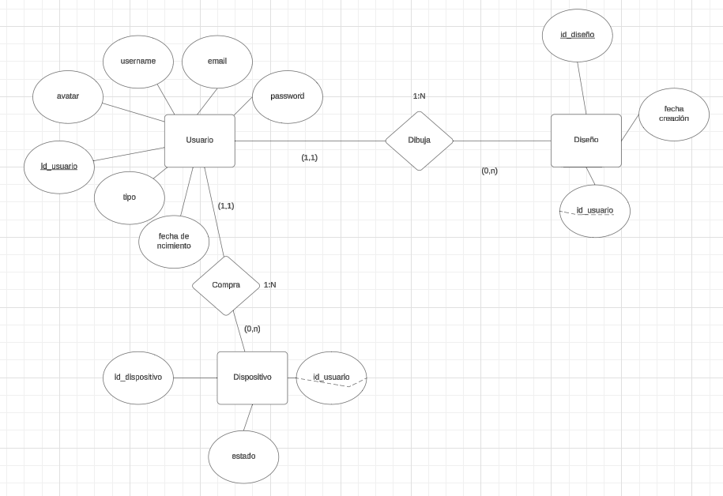

# FASE DE DESEÑO

- [FASE DE DESEÑO](#fase-de-deseño)
  - [1- Diagrama da arquitectura](#1--diagrama-da-arquitectura)
  - [2- Casos de uso](#2--casos-de-uso)
  - [3- Diagrama de Base de Datos](#3--diagrama-de-base-de-datos)
  - [4- Deseño de interface de usuarios](#4--deseño-de-interface-de-usuarios)

## 1- Diagrama da arquitectura

La siguiente imagen muestra los diagramas de despliegue y componentes que permiten ver como se conectan cada una de las partes que forman parte de la aplicación.

Como se puede ver consta de tres nodos:
- El dispositivo con el cliente que visualiza la aplicación. 
- El servidor web de Xampp que contiene un servidor Apache, el lenguaje PHP que se usa para el backend, la base de datos mariaDB con el phpMyAdmin y la propia aplicación alojada.
- El periférico POV.

## 2- Casos de uso

Para una mejor comprensión de las funcionalidades de la aplicación se dividieron en tres partes, gestión de usuarios, compras y gestión administrativa con un diagrama de casos de uso para cada una de esas partes.

## 3- Diagrama de Base de Datos

> *EXPLICACIÓN:* Neste apartado incluiranse os diagramas relacionados coa Base de Datos:
>
> - Modelo Entidade/relación
> - Modelo relacional
>
> Pódese entregar a captura do phpMyAdmin se se emprega MariaDB como Modelo relacional.

Para representar el diseño de la base de datos se realizaró el diagrama entidad-relación.

Del diagrama anterior se realizó su correspondiente modelo relacional:

_Tabla usuario_:

| Campo              | Descripción  |  Definición |
|--------------------|--------------|-------------|
| id_usuario         |              |             |
| username           |              |             |
| password           |              |             |             
| email              |              |             |
| fecha nacimient    |              |             |
| tipo               |              |             |

## 4- Deseño de interface de usuarios

Dado que el diseño de la interfaz de usuario ya estaba más avanzado, se realizó un prototipo en vez de mockups. 